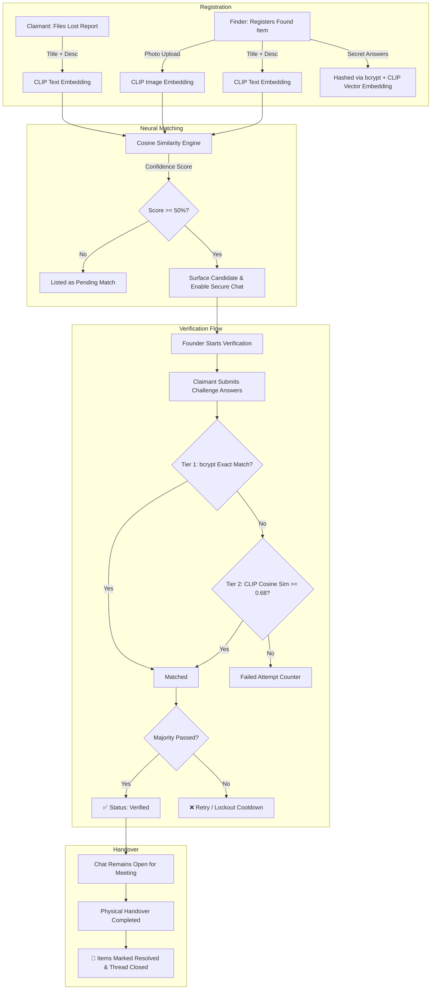

<div align="center">
        
  
# 🌟 Stay Composed
### *Next-Gen AI-Powered Campus Lost & Found and Emergency Assistance*

[](https://nextjs.org/)
[](https://www.typescriptlang.org/)
[](https://tailwindcss.com/)
[](https://fastapi.tiangolo.com/)
[](https://github.com/openai/CLIP)
[](https://www.mongodb.com/)
[](https://cloudinary.com/)
[](https://developer.mozilla.org/en-US/docs/Web/API/WebSockets_API)
[](#-mobile-app-download-android-apk)

<p align="center">
  <strong>Campus assistance reaching the right person, fast &mdash; without panic or vulnerability.</strong>
</p>

[✨ Core Features](#-key-features) • [📱 Download APK](#-mobile-app-download-android-apk) • [🧠 AI Verification](#-how-the-ai-pipeline-works) • [🔄 Lifecycle](#-complete-lifecycle-architecture) • [🚀 Quick Start](#-getting-started) • [🎨 Design System](#-design--ui-philosophy)

---

</div>

## 📌 Executive Summary

**Stay Composed** revolutionizes campus security, lost-and-found recovery, and emergency response through privacy-first neural matching:
1. **Unlisted Found Vault**: Found items are *never* publicly browsable. They surface exclusively when a legitimate claimant submits a matching lost report.
2. **CLIP Multimodal Embeddings**: Evaluates product photos and natural-language descriptions concurrently into a shared semantic vector space.
3. **Two-Tier Semantic Verification**: Combines cryptographic bcrypt hashing with fallback **Sentence-Transformer AI similarity** ($\ge 0.68$), ensuring owners aren't penalized or locked out for phrasing variations (e.g., *"Spider-Man sticker"* vs *"spiderman sticker on back"*).
4. **Active Handover Coordination**: Real-time WebSocket chat with one-tap campus templates, and permanent resolution locks.
5. **Campus Blood Network**: Instant departmental SMTP broadcasts to registered staff and faculty directories for critical blood emergencies.

---

## ✨ Key Features

### 🔍 1. True Owner Matching Engine (AI + Vision)
- **Zero Public Browsing**: Prevents bad actors from browsing items to fabricate ownership claims.
- **Multimodal AI Analysis**: Uses `clip-ViT-B-32` text + image embeddings. Matches visual color, geometry, and contextual traits (e.g., *"Matte black Dell laptop"* matches an unbranded black notebook photo).
- **Match Confidence Gauge**: Displays live confidence percentages ($0-100\%$) powered by cosine similarity matrices.

### 🛡️ 2. Two-Tier Ownership Challenge
- **Dynamic Challenge Questions**: Founders formulate 1 to 3 secret identifying questions (e.g., *"What sticker is under the flap?"*, *"What lockscreen wallpaper is set?"*).
- **Cryptographic Security**: Answers are hashed via bcrypt with salt &mdash; plaintext answers are **never stored** in the database.
- **AI Semantic Fallback**: If exact string matching fails, the AI evaluates semantic cosine similarity. Genuine claimants answering with synonyms or minor spelling shifts are verified seamlessly!
- **Anti-Brute Force Protection**: Automatic exponential rate-limiting and lockout countdown prevents guessing attempts.

### 💬 3. Protected Real-Time Coordination Chat
- **Controlled Gateway**: Chat opens only once the neural match confidence reaches the strict threshold ($\ge 50\%$).
- **Privacy & Safety First**: Real names, roll numbers, phone numbers, and departments are completely masked (`Campus Member 24S***`).
- **Quick-Coordinate Chips**: One-tap quick response templates (`"📍 Meet at Library entrance"`, `"🏛️ Meet at RTA Auditorium"`, `"🚶 I have reached the spot"`).
- **Persistent Handover**: Both parties can coordinate meeting logistics without the chat prematurely closing.

### 🤝 4. Guaranteed Node Disconnection & Resolution
- **Permanent Resolution**: When the handover is confirmed, the items transition to `✅ Resolved & Handed Over`.
- **Complete Disconnection**: The connection between the founder and claimant is permanently severed. The pair disappears from all match recommendations.
- **Audit History**: Available in the user's personal profile for record-keeping.

### 🩸 5. Campus Emergency Blood Alert System
- **Automated Directory Routing**: Alerts are instantly routed to verified campus staff and student directories.
- **Real-Time SMTP Dispatch**: Direct email delivery using secure SMTP channels.
- **No-Friction Response**: Faculty and peers can respond with a single tap to help patients without waiting for complex app onboarding.

### 📸 6. Dynamic Scaling & Inspection Modal
- **Smart Form Scaling**: As challenge questions are added, the photo upload container dynamically flexes and stretches to balance the layout.
- **High-Resolution Inspection**: Dedicated `ImageViewerModal` with keyboard <kbd>ESC</kbd> support and backdrop blur lets claimants and finders inspect fine product details without image cropping.

---

## 🧠 How the AI Pipeline Works



---

## 🎨 Design & UI Philosophy

The Stay Composed interface combines clean aesthetics with high-urgency utility:

| Color Palette | Hex Token | Usage |
|---|---|---|
| **Deep Ink** | `#111827` | Headings, primary typography, high-contrast badges |
| **Paper Canvas** | `#F8F9FA` | Clean background and soft card containers |
| **Electric Purple** | `#6366F1` | Primary action buttons, lost complaint badges, active indicators |
| **Sky Blue** | `#0EA5E9` | AI Match confidence meters, secondary chips |
| **Emerald Green** | `#10B981` | Verified status, resolution badges, successful claims |
| **Brick Red** | `#EF4444` | Blood donation alerts, validation notices, rate limits |

> [!TIP]
> **Accessibility First**: All text colors maintain WCAG AA contrast against backgrounds, with full responsive support for mobile, tablet, and widescreen monitors.

---

## 🛠️ Project Structure

```
stay-composed/
├── backend/                       # FastAPI Python Backend
│   ├── app/
│   │   ├── main.py                # Server entry point & CORS
│   │   ├── config.py              # Environment configuration & settings
│   │   ├── database.py            # Motor/MongoDB Atlas connection
│   │   ├── models.py              # Pydantic schema validation
│   │   ├── security.py            # bcrypt hashing & chat sanitization
│   │   ├── routers/
│   │   │   ├── items.py           # Lost & found CRUD + candidate matching
│   │   │   ├── claims.py          # Two-tier AI semantic verification
│   │   │   ├── chat.py            # WebSocket manager & handover completion
│   │   │   └── blood_alert.py     # Staff directory SMTP broadcast
│   │   └── services/
│   │       ├── clip_service.py    # CLIP model loading & embeddings
│   │       ├── matching.py        # Weighted cosine similarity scoring
│   │       └── email_service.py   # aiosmtplib broadcast delivery
│   └── requirements.txt
│
└── src/                           # Next.js 15 Frontend
    ├── app/
    │   ├── layout.tsx             # Root layout with NextAuth Provider
    │   ├── page.tsx               # Landing hero with quick portals
    │   ├── true-owner/
    │   │   └── page.tsx           # Main TrueOwner hub (Complaints, Matches, Found Items)
    │   ├── blood-alert/
    │   │   └── page.tsx           # Emergency blood request portal
    │   ├── profile/
    │   │   └── page.tsx           # User history & resolved reports
    │   └── settings/
    │       └── page.tsx           # Backend URL & preference toggles
    ├── components/
    │   ├── ChatPanel.tsx          # Real-time WebSocket chat modal & templates
    │   └── Navbar.tsx             # Global navigation bar
    ├── lib/
    │   ├── apiClient.ts           # Dynamic Axios client
    │   ├── chatClient.ts          # WebSocket connector & event hooks
    │   └── auth.ts                # NextAuth Google/Campus OAuth
    └── types/
        └── index.ts               # Shared TypeScript models
```

---

## 📱 Mobile App Download (Android APK)

Stay Composed is also provided as a standalone **Android application (.apk)** tailored for portable campus use:

| Property | Details |
|---|---|
| **Package Name** | `in.tcarts.staycomposed` |
| **Version** | `v1.0.0 (Production Release)` |
| **Architectures** | `arm64-v8a`, `armeabi-v7a`, `x86_64` |
| **Minimum OS** | Android 8.0 (Oreo) or higher |
| **Direct Download** | [⬇️ Download `StayComposed-v1.0.apk`](file:///c:/stay-composed/public/downloads/stay-composed-app.apk) |

### 🌟 Mobile-Exclusive Features
* 📸 **Direct Camera Sensor Integration**: Take photos of found items directly inside the app with native auto-compression prior to neural CLIP embeddings.
* 🔔 **Instant Handover Push Notifications**: Vibrations and push updates when high-confidence claimant matches occur.
* 📍 **One-Tap Campus Geopresets**: Rapidly tag building locations (NB, RTA, Library, Physics Block) without typing.
* 🩸 **Rapid SOS Blood Request**: Fast emergency button allowing students to broadcast donor needs in under 15 seconds.

### 📥 Sideloading Instructions (Android)
1. Download the `.apk` using the button above or from the website navbar.
2. Open your Android device's **Files / Downloads** folder and tap `StayComposed-v1.0.apk`.
3. If prompted by your system, enable **"Install from unknown sources"** in device Settings.
4. Tap **Install** and open the application.
5. Sign in with your verified campus Google account (`@tcarts.in`).

---

## 🚀 Getting Started

### Prerequisites
- **Node.js**: `v18+` or `v20+`
- **Python**: `v3.11` or `v3.12`
- **MongoDB Atlas** database cluster
- **Cloudinary** account (for image storage)
- **Google Cloud Console** credentials (for NextAuth Google Login)

---

### 1️⃣ Backend Setup

```bash
# Navigate to backend
cd backend

# Create and activate a Python virtual environment
python -m venv venv
# On Windows:
.\venv\Scripts\activate
# On macOS/Linux:
source venv/bin/activate

# Install dependencies
pip install -r requirements.txt

# Configure environment variables in backend/.env
# (See backend/.env.example for keys: MONGODB_URI, DB_NAME, SMTP_*, etc.)

# Start FastAPI backend
uvicorn app.main:app --host 0.0.0.0 --port 8000 --reload
```

---

### 2️⃣ Frontend Setup

```bash
# Navigate to project root
cd ..

# Install npm packages
npm install

# Configure environment variables in .env.local:
# NEXTAUTH_URL=http://localhost:3000
# NEXTAUTH_SECRET=your-nextauth-secret
# GOOGLE_CLIENT_ID=your-google-client-id
# GOOGLE_CLIENT_SECRET=your-google-client-secret
# CLOUDINARY_CLOUD_NAME=your-cloud-name
# CLOUDINARY_UPLOAD_PRESET=your-preset

# Run Next.js development server
npm run dev
```

Visit **`http://localhost:3000`** in your browser! 🚀

---

## 🔐 Security & Privacy Commitments

> [!IMPORTANT]
> - **Zero Plaintext Secrets**: Secret features and challenge answers are hashed using `bcrypt` and vector-embedded. No human can ever read them.
> - **Domain Isolation**: Restricts account onboarding to verified institutional email addresses.
> - **Zero Public Found Directory**: Prevents unauthorized scanning and targeted social engineering.
> - **Automated Sanitization**: Every chat string is stripped of HTML/script injection tags before transmission.
> - **Audited Handover**: Handover timestamps and verification details are recorded with cryptographic confidence scores.

---

## 👥 Authors & Acknowledgments

Built with ❤️ for campus safety and student support. Special thanks to the open-source community behind **OpenAI CLIP**, **Sentence-Transformers**, **FastAPI**, and **Next.js**.

<div align="center">
  <sub>Stay Composed &bull; True Owner Verification System &bull; 2026</sub>
</div>
